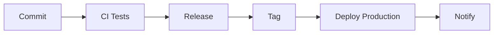

# Sistema de Versionamento Automático

Este projeto utiliza um sistema robusto de versionamento automático baseado em **Semantic Versioning** e **Conventional Commits**.

## 📋 Índice

- [Visão Geral](#visão-geral)
- [Conventional Commits](#conventional-commits)
- [Como Fazer Commits](#como-fazer-commits)
- [Versionamento Semântico](#versionamento-semântico)
- [CHANGELOG Automático](#changelog-automático)
- [GitHub Releases](#github-releases)
- [Deploy Automático](#deploy-automático)
- [Notificações](#notificações)
- [Comandos Úteis](#comandos-úteis)
- [Troubleshooting](#troubleshooting)

## 🎯 Visão Geral

O sistema automatiza completamente o processo de versionamento e release:

1. ✅ **Conventional Commits** - Padronização de mensagens de commit
2. ✅ **Auto-increment** - Versão incrementada automaticamente no package.json
3. ✅ **CHANGELOG.md** - Gerado automaticamente do histórico de commits
4. ✅ **Git Tags** - Tags criadas automaticamente para cada versão
5. ✅ **Release Notes** - Publicadas automaticamente no GitHub
6. ✅ **Deploy Trigger** - Deploy automático acionado após release
7. ✅ **Notificações** - Alertas via Slack/Webhook sobre novas versões

## 📝 Conventional Commits

### Tipos de Commit Suportados

| Tipo       | Descrição                                      | Incremento de Versão |
|------------|------------------------------------------------|----------------------|
| `feat:`    | Nova funcionalidade                            | MINOR (0.x.0)        |
| `fix:`     | Correção de bug                                | PATCH (0.0.x)        |
| `perf:`    | Melhoria de performance                        | PATCH (0.0.x)        |
| `refactor:`| Refatoração de código                          | PATCH (0.0.x)        |
| `build:`   | Mudanças no sistema de build                   | PATCH (0.0.x)        |
| `revert:`  | Reversão de commit anterior                    | PATCH (0.0.x)        |
| `docs:`    | Apenas documentação                            | Nenhum               |
| `style:`   | Formatação, espaços em branco, etc             | Nenhum               |
| `test:`    | Adição ou correção de testes                   | Nenhum               |
| `ci:`      | Mudanças em CI/CD                              | Nenhum               |
| `chore:`   | Outras mudanças que não modificam src ou test  | Nenhum               |

### BREAKING CHANGES

Qualquer commit com `BREAKING CHANGE:` no corpo ou `!` após o tipo resulta em:
- **MAJOR version bump** (x.0.0)

Exemplos:
```bash
feat!: remove suporte para Node.js 14
# ou
feat: adiciona nova API

BREAKING CHANGE: remove endpoint /api/v1/old
```

## 🚀 Como Fazer Commits

### Método 1: Commitizen (Recomendado)

Use o comando interativo para criar commits padronizados:

```bash
npm run commit
```

Isso abrirá um assistente interativo que guiará você através do processo.

### Método 2: Commit Manual

Siga o formato:

```bash
<tipo>[escopo opcional]: <descrição>

[corpo opcional]

[rodapé opcional]
```

Exemplos:

```bash
# Feature simples
git commit -m "feat: adiciona calculadora de economia"

# Fix com escopo
git commit -m "fix(auth): corrige validação de token expirado"

# Feature com breaking change
git commit -m "feat(api)!: migra para nova estrutura de API"

# Commit com corpo e referência
git commit -m "fix: corrige erro no formulário de lead

O erro ocorria quando o usuário não preenchia o WhatsApp.
Agora exibimos mensagem de erro apropriada.

Closes #123"
```

## 📊 Versionamento Semântico

O projeto segue o padrão [Semantic Versioning 2.0.0](https://semver.org/):

```
MAJOR.MINOR.PATCH
```

- **MAJOR**: Mudanças incompatíveis com versões anteriores (breaking changes)
- **MINOR**: Nova funcionalidade compatível com versão anterior
- **PATCH**: Correções de bugs compatíveis com versão anterior

### Exemplo de Evolução

```
0.1.0  → feat: nova feature        → 0.2.0
0.2.0  → fix: correção de bug      → 0.2.1
0.2.1  → feat!: breaking change    → 1.0.0
1.0.0  → fix: correção             → 1.0.1
1.0.1  → feat: nova feature        → 1.1.0
```

## 📄 CHANGELOG Automático

O `CHANGELOG.md` é gerado automaticamente com:

- ✅ Agrupamento por tipo de mudança
- ✅ Links para commits e PRs
- ✅ Menção a colaboradores
- ✅ Data de cada release
- ✅ Formato Keep a Changelog

Exemplo de seção gerada:

```markdown
## [1.2.0](https://github.com/Sudo-psc/svlentes-hero-shop/compare/v1.1.0...v1.2.0) (2025-10-19)

### 🚀 Features

* adiciona sistema de notificações ([abc123](https://github.com/Sudo-psc/svlentes-hero-shop/commit/abc123))
* implementa cache de dados ([def456](https://github.com/Sudo-psc/svlentes-hero-shop/commit/def456))

### 🐛 Bug Fixes

* corrige erro no formulário de contato ([ghi789](https://github.com/Sudo-psc/svlentes-hero-shop/commit/ghi789))
```

## 🏷️ Git Tags e GitHub Releases

### Tags Automáticas

Cada release cria automaticamente:
- Tag Git no formato `vX.Y.Z`
- Tag enviada para o repositório remoto
- Release publicada no GitHub

### Release Notes

As release notes incluem:

1. **Sumário executivo** das mudanças
2. **Mudanças agrupadas por categoria**
3. **Links para commits relevantes**
4. **Menção a colaboradores**
5. **Instruções de upgrade** (se aplicável)

### Visualizar Releases

Acesse: https://github.com/Sudo-psc/svlentes-hero-shop/releases

## 🚀 Deploy Automático

### Fluxo de Deploy



### Branches e Deploys

| Branch     | Deploy Para | Versão       |
|------------|-------------|--------------|
| `main`     | Production  | v1.2.3       |
| `develop`  | Staging     | v1.2.3-beta.1|
| `staging`  | Staging     | v1.2.3-rc.1  |

### Trigger Manual

Para forçar um deploy sem criar release:

```bash
# Via GitHub Actions UI
# Acesse: Actions > Deploy to Production > Run workflow
```

## 🔔 Notificações

O sistema envia notificações automáticas sobre:

### Slack (se configurado)

```json
{
  "event": "release",
  "version": "v1.2.3",
  "branch": "main",
  "changes": "5 features, 3 fixes"
}
```

### Webhook N8N

```json
{
  "version": "v1.2.3",
  "release_url": "https://github.com/.../releases/tag/v1.2.3",
  "commit": "abc123...",
  "author": "developer"
}
```

### Configurar Notificações

Adicione aos GitHub Secrets:

```bash
SLACK_WEBHOOK_URL=https://hooks.slack.com/services/...
N8N_WEBHOOK_URL=https://n8n.example.com/webhook/...
```

## 🛠️ Comandos Úteis

### Commits

```bash
# Commit interativo (recomendado)
npm run commit

# Commit manual
git commit -m "feat: nova funcionalidade"
```

### Release

```bash
# Criar release (automático via CI)
# Apenas faça push para main/master

# Testar release localmente (dry-run)
npm run release:dry

# Ver próxima versão sem publicar
npx semantic-release --dry-run
```

### Verificação

```bash
# Validar mensagem de commit
echo "feat: nova feature" | npx commitlint

# Ver histórico de versões
git tag -l -n1

# Ver CHANGELOG
cat CHANGELOG.md
```

### Git Hooks

Os hooks são executados automaticamente:

```bash
# pre-commit: executa linting
# commit-msg: valida mensagem com commitlint
```

## 🔧 Troubleshooting

### Erro: "Commit message não segue o padrão"

**Problema:** Commitlint rejeitou o commit

**Solução:**
```bash
# Use o formato correto
git commit -m "feat: descrição da mudança"

# Ou use commitizen
npm run commit
```

### Erro: "No release"

**Problema:** Nenhuma versão foi criada após push

**Possíveis causas:**
1. Commits não seguem conventional commits
2. Apenas commits de docs/style/test (não geram release)
3. Mensagem contém `[skip ci]`

**Solução:**
```bash
# Verifique os commits
git log --oneline -5

# Faça um commit que gere release
git commit -m "fix: correção importante"
```

### Release criada mas deploy não executou

**Problema:** Deploy não foi acionado automaticamente

**Solução:**
```bash
# Trigger manual via GitHub Actions
# Ou aguarde alguns minutos (pode haver delay)
```

### Erro de permissão no GitHub

**Problema:** Semantic release não consegue criar tag/release

**Solução:**
Verifique as permissões no workflow:
- `contents: write`
- `issues: write`
- `pull-requests: write`

### CHANGELOG não atualiza

**Problema:** CHANGELOG.md não é gerado ou não atualiza

**Solução:**
```bash
# Verifique se o arquivo existe
ls -la CHANGELOG.md

# Execute manualmente
npx semantic-release --dry-run

# Verifique a configuração
cat .releaserc.json
```

## 📚 Recursos Adicionais

### Documentação Oficial

- [Conventional Commits](https://www.conventionalcommits.org/)
- [Semantic Versioning](https://semver.org/)
- [Semantic Release](https://semantic-release.gitbook.io/)
- [Commitlint](https://commitlint.js.org/)
- [Commitizen](http://commitizen.github.io/cz-cli/)

### Configuração Local

Para desenvolvedores, configure o Git:

```bash
# Configure seu nome e email
git config user.name "Seu Nome"
git config user.email "seu@email.com"

# Instale hooks
npm install

# Teste o commitizen
npm run commit
```

## 🔐 Segurança

### Secrets Necessários

Configure no GitHub Repository Settings > Secrets:

```yaml
GITHUB_TOKEN:      # Criado automaticamente pelo GitHub
NPM_TOKEN:         # Se publicar no npm (opcional)
SLACK_WEBHOOK_URL: # Para notificações Slack (opcional)
N8N_WEBHOOK_URL:   # Para integrações N8N (opcional)
```

### Proteção de Branches

Recomendado para `main`:
- ✅ Require pull request reviews
- ✅ Require status checks to pass
- ✅ Require branches to be up to date
- ✅ Include administrators

## 📈 Métricas

Acompanhe métricas de versionamento:

- Frequência de releases
- Tipos de mudanças (feat vs fix)
- Breaking changes por período
- Tempo entre releases
- Taxa de rollback

Acesse o dashboard: [GitHub Insights](https://github.com/Sudo-psc/svlentes-hero-shop/pulse)

---

## ✅ Checklist do Desenvolvedor

Antes de fazer commit:

- [ ] Código está funcionando localmente
- [ ] Testes passam (`npm test`)
- [ ] Linting passa (`npm run lint`)
- [ ] Mensagem de commit segue conventional commits
- [ ] Documentação atualizada (se necessário)
- [ ] Breaking changes documentadas (se houver)

Após o commit:

- [ ] CI/CD passou com sucesso
- [ ] Release foi criada (se esperado)
- [ ] Deploy foi executado (se esperado)
- [ ] CHANGELOG foi atualizado
- [ ] Release notes estão corretas

---

**Dúvidas?** Abra uma issue ou consulte a [documentação completa](./INDICE_DOCUMENTACAO.md).
