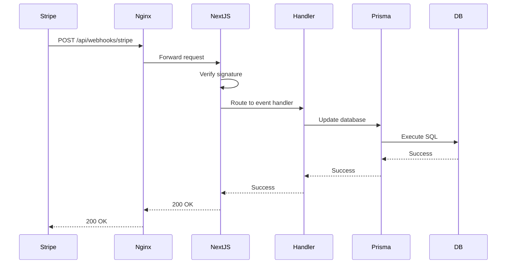

# Configuração de Webhooks Stripe - Guia Completo

**Data**: 2025-11-02
**Autor**: Dr. Philipe Saraiva Cruz
**Status**: 📚 GUIA DE CONFIGURAÇÃO

---

## 📋 Visão Geral

Este documento fornece instruções passo a passo para configurar webhooks do Stripe para o projeto SVLentes. Os webhooks permitem que o Stripe notifique nossa aplicação sobre eventos importantes relacionados a assinaturas e pagamentos.

---

## 🔧 Pré-requisitos

- [ ] Conta Stripe ativa (Teste ou Produção)
- [ ] Chaves API configuradas via `scripts/setup-stripe.sh`
- [ ] Aplicação Next.js rodando em produção ou túnel ngrok para desenvolvimento
- [ ] Acesso ao Stripe Dashboard

---

## 🌐 Endpoint do Webhook

### Produção
```
https://svlentes.com.br/api/webhooks/stripe
```

### Desenvolvimento Local (via ngrok)
```bash
# 1. Instale ngrok se ainda não tiver
npm install -g ngrok

# 2. Inicie o servidor Next.js
npm run dev

# 3. Em outro terminal, inicie o túnel ngrok
ngrok http 3000

# 4. Use a URL fornecida pelo ngrok
# Exemplo: https://abc123.ngrok.io/api/webhooks/stripe
```

---

## 📝 Passos para Configuração

### 1. Acessar o Stripe Dashboard

**Teste**: https://dashboard.stripe.com/test/webhooks
**Produção**: https://dashboard.stripe.com/webhooks

### 2. Criar Novo Webhook Endpoint

1. Clique em **"Add endpoint"** ou **"Adicionar endpoint"**
2. Preencha os campos:

   - **Endpoint URL**:
     Produção: `https://svlentes.com.br/api/webhooks/stripe`
     Desenvolvimento: `https://[seu-ngrok-id].ngrok.io/api/webhooks/stripe`

   - **Description** (Opcional):
     `SVLentes Subscription & Payment Webhooks`

   - **Version**: Latest (mais recente)

### 3. Selecionar Eventos

Marque os seguintes eventos para receber notificações:

#### ✅ Eventos de Checkout
- `checkout.session.completed` - Quando um checkout é concluído com sucesso

#### ✅ Eventos de Assinatura
- `customer.subscription.created` - Nova assinatura criada
- `customer.subscription.updated` - Assinatura atualizada (mudança de plano, status, etc.)
- `customer.subscription.deleted` - Assinatura cancelada

#### ✅ Eventos de Invoice/Pagamento
- `invoice.payment_succeeded` - Pagamento de invoice bem-sucedido
- `invoice.payment_failed` - Falha no pagamento de invoice

### 4. Obter Webhook Secret

Após criar o webhook:

1. Clique no webhook recém-criado
2. Na seção **Signing secret**, clique em **"Reveal"** ou **"Revelar"**
3. Copie o valor que começa com `whsec_...`

### 5. Atualizar Variáveis de Ambiente

Abra o arquivo `.env.local` e atualize:

```bash
STRIPE_WEBHOOK_SECRET=whsec_seu_segredo_aqui
```

Ou use o script de configuração:

```bash
./scripts/setup-stripe.sh
```

### 6. Reiniciar Aplicação

```bash
# Desenvolvimento
npm run dev

# Produção (systemd)
systemctl restart svlentes-nextjs
```

---

## 🧪 Testar Webhooks

### Opção 1: Stripe CLI (Recomendado)

```bash
# 1. Instale o Stripe CLI
# macOS: brew install stripe/stripe-cli/stripe
# Linux: https://stripe.com/docs/stripe-cli

# 2. Autentique
stripe login

# 3. Encaminhe eventos para localhost
stripe listen --forward-to localhost:3000/api/webhooks/stripe

# 4. Gatilhe eventos de teste
stripe trigger checkout.session.completed
stripe trigger invoice.payment_succeeded
stripe trigger customer.subscription.created
```

### Opção 2: Stripe Dashboard

1. Acesse **Developers > Webhooks** no Stripe Dashboard
2. Clique no webhook configurado
3. Vá para a aba **"Send test webhook"** ou **"Enviar webhook de teste"**
4. Selecione um evento (ex: `invoice.payment_succeeded`)
5. Clique em **"Send test webhook"**

### Opção 3: Criar Assinatura Real (Teste)

1. Acesse: https://svlentes.com.br/planos
2. Selecione um plano
3. Use cartão de teste Stripe:
   - Número: `4242 4242 4242 4242`
   - Data: Qualquer data futura
   - CVC: Qualquer 3 dígitos
4. Complete o checkout
5. Verifique logs do webhook

---

## 📊 Monitoramento de Webhooks

### Logs no Stripe Dashboard

1. Acesse **Developers > Webhooks**
2. Clique no webhook configurado
3. Vá para a aba **"Attempted events"** ou **"Eventos tentados"**
4. Verifique:
   - ✅ Status 200: Sucesso
   - ❌ Status 4xx/5xx: Erro (verifique logs da aplicação)

### Logs na Aplicação

```bash
# Desenvolvimento
npm run dev
# Logs aparecerão no terminal

# Produção (systemd)
journalctl -u svlentes-nextjs -f

# Filtrar apenas webhooks Stripe
journalctl -u svlentes-nextjs -f | grep STRIPE
```

### Métricas Importantes

- **Taxa de Sucesso**: Deve ser > 95%
- **Tempo de Resposta**: Deve ser < 1 segundo
- **Tentativas de Retry**: Stripe tenta até 3x se falhar

---

## 🐛 Troubleshooting

### Problema: Webhook retorna 401 Unauthorized

**Causa**: Assinatura inválida ou webhook secret incorreto

**Solução**:
```bash
# Verifique o webhook secret
grep STRIPE_WEBHOOK_SECRET .env.local

# Deve começar com whsec_
# Se não, copie novamente do Stripe Dashboard
```

### Problema: Webhook retorna 500 Internal Server Error

**Causa**: Erro no processamento do evento

**Solução**:
```bash
# Verifique logs da aplicação
journalctl -u svlentes-nextjs -n 100

# Procure por [STRIPE_WEBHOOK_ERROR] ou stack traces
```

### Problema: Eventos não são recebidos

**Causa**: URL incorreta ou firewall bloqueando

**Solução**:
```bash
# 1. Verifique se a URL está correta no Stripe Dashboard
# 2. Teste manualmente
curl -I https://svlentes.com.br/api/webhooks/stripe

# Deve retornar: 405 Method Not Allowed (POST é esperado)

# 3. Verifique firewall/nginx
systemctl status nginx
nginx -t
```

### Problema: Customer não encontrado

**Causa**: Migração Prisma não aplicada ou customer ID não linkado

**Solução**:
```bash
# 1. Aplique a migração
npx prisma migrate deploy

# 2. Verifique se campo stripeCustomerId existe
npx prisma studio
# Abra a tabela User e verifique a coluna stripe_customer_id

# 3. Se necessário, force o link manual
# (ver documentação de migração de dados)
```

---

## 🔒 Segurança

### Validação de Assinatura

✅ **Implementado**: O endpoint `/api/webhooks/stripe/route.ts` valida a assinatura do webhook usando:

```typescript
const event = stripe.webhooks.constructEvent(
  body,
  signature,
  process.env.STRIPE_WEBHOOK_SECRET
)
```

### Idempotência

✅ **Implementado**: Eventos duplicados são tratados via:
- Uso de IDs únicos do Stripe (`invoice.id`, `subscription.id`)
- Operações `upsert` no Prisma

### Rate Limiting

⚠️ **Não implementado ainda**: Webhooks não têm rate limiting

**Recomendação**: O Stripe já implementa retry exponencial, então não é crítico

---

## 📈 Eventos Tratados pelo Sistema

| Evento | Handler | O que Faz |
|--------|---------|-----------|
| `checkout.session.completed` | `handleCheckoutCompleted` | Processa checkout finalizado, cria/atualiza assinatura |
| `customer.subscription.created` | `handleSubscriptionCreated` | Cria assinatura no banco de dados |
| `customer.subscription.updated` | `handleSubscriptionUpdated` | Atualiza status, valor, data de renovação |
| `customer.subscription.deleted` | `handleSubscriptionDeleted` | Marca assinatura como CANCELLED |
| `invoice.payment_succeeded` | `handleInvoicePaymentSucceeded` | Registra pagamento bem-sucedido |
| `invoice.payment_failed` | `handleInvoicePaymentFailed` | Marca pagamento como OVERDUE, atualiza subscription |

---

## 🔄 Fluxo de Processamento de Webhook



---

## 📝 Checklist de Configuração

- [ ] Webhook endpoint criado no Stripe Dashboard
- [ ] Eventos corretos selecionados (checkout, subscription, invoice)
- [ ] Webhook secret copiado e adicionado ao `.env.local`
- [ ] Migração Prisma aplicada (`npx prisma migrate deploy`)
- [ ] Aplicação reiniciada
- [ ] Teste com Stripe CLI ou Dashboard bem-sucedido
- [ ] Logs monitorados e sem erros
- [ ] Documentação lida e entendida

---

## 📚 Recursos Adicionais

- **Stripe Webhooks Documentation**: https://stripe.com/docs/webhooks
- **Stripe CLI Documentation**: https://stripe.com/docs/stripe-cli
- **Stripe Testing Guide**: https://stripe.com/docs/testing
- **Stripe Event Types**: https://stripe.com/docs/api/events/types

---

## 🆘 Suporte

Em caso de problemas:

1. Verifique logs: `journalctl -u svlentes-nextjs -f`
2. Consulte documentação Stripe
3. Crie issue no repositório com logs relevantes
4. Entre em contato com o time de desenvolvimento

---

**Documento gerado em**: 2025-11-02
**Versão**: 1.0.0
**Status**: Pronto para Produção
