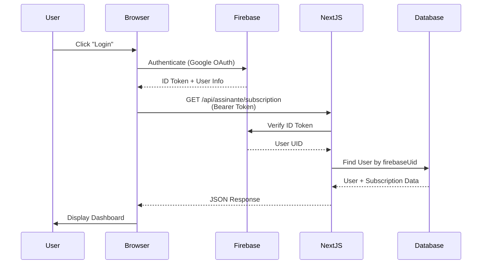
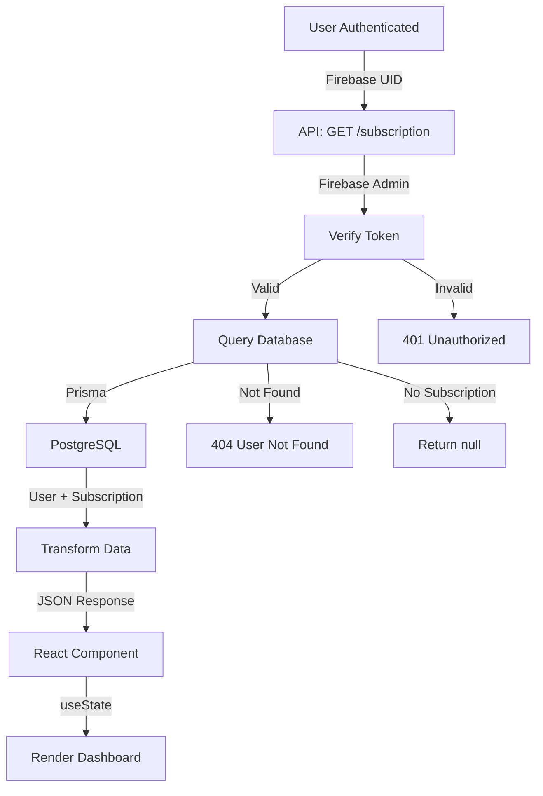
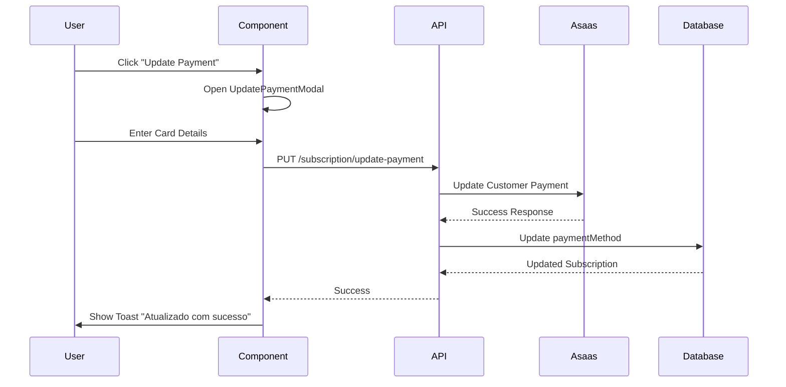

# 🏗️ Subscriber Dashboard - System Architecture

> **Technical architecture and system design documentation**
> **Author**: Dr. Philipe Saraiva Cruz
> **Date**: 2025-10-23

---

## System Overview

```
┌─────────────────────────────────────────────────────────────┐
│                     Client (Browser)                        │
│  ┌──────────────┐  ┌──────────────┐  ┌──────────────┐     │
│  │   React UI   │  │  Firebase    │  │   Framer     │     │
│  │  Components  │  │     Auth     │  │   Motion     │     │
│  └──────────────┘  └──────────────┘  └──────────────┘     │
└─────────────────────────────────────────────────────────────┘
                              │
                              │ HTTPS / Bearer Token
                              ▼
┌─────────────────────────────────────────────────────────────┐
│              Next.js 15 Application (Port 5000)             │
│  ┌──────────────┐  ┌──────────────┐  ┌──────────────┐     │
│  │  App Router  │  │  API Routes  │  │  Middleware  │     │
│  │  (React 19)  │  │  (REST API)  │  │  (CSRF/Rate) │     │
│  └──────────────┘  └──────────────┘  └──────────────┘     │
└─────────────────────────────────────────────────────────────┘
                              │
                ┌─────────────┼─────────────┐
                │             │             │
                ▼             ▼             ▼
┌──────────────────┐ ┌──────────────┐ ┌─────────────┐
│  Firebase Admin  │ │   Prisma     │ │   Asaas     │
│   (Auth Verify)  │ │    ORM       │ │   Payment   │
└──────────────────┘ └──────────────┘ └─────────────┘
                              │
                              ▼
                    ┌──────────────────┐
                    │   PostgreSQL     │
                    │   Database       │
                    └──────────────────┘
```

---

## Data Flow Architecture

### Authentication Flow



### Subscription Data Flow



### Payment Update Flow



---

## Component Architecture

### Dashboard Page Structure

```
DashboardPage
├── AuthProvider (Context)
├── SubscriptionProvider (Context)
└── DashboardContent
    ├── Header
    │   ├── Logo
    │   ├── UserMenu
    │   └── SignOutButton
    ├── Main Content
    │   ├── WelcomeSection
    │   ├── SubscriptionCards
    │   │   ├── EnhancedSubscriptionCard
    │   │   └── PaymentInfoCard
    │   ├── BenefitsDisplay
    │   ├── QuickActions
    │   └── SubscriptionHistoryTimeline
    ├── Modals (Portal)
    │   ├── OrdersModal
    │   ├── InvoicesModal
    │   ├── ChangePlanModal
    │   ├── UpdateAddressModal
    │   └── UpdatePaymentModal
    └── ToastContainer (Portal)
```

### State Management

```typescript
// Global Context
AuthContext
├── user: FirebaseUser
├── loading: boolean
└── signOut: () => void

SubscriptionContext
├── subscription: Subscription | null
├── user: User | null
├── loading: boolean
├── error: string | null
└── refetch: () => Promise<void>

// Local Component State
DashboardPage
├── modals: { orders: boolean, invoices: boolean, ... }
├── isLoading: boolean
└── toasts: Toast[]
```

---

## Database Schema

### Core Tables

```sql
-- User Table
CREATE TABLE "User" (
  id            TEXT PRIMARY KEY,
  firebaseUid   TEXT UNIQUE NOT NULL,
  name          TEXT NOT NULL,
  email         TEXT UNIQUE NOT NULL,
  phone         TEXT,
  avatarUrl     TEXT,
  createdAt     TIMESTAMP DEFAULT NOW()
);

-- Subscription Table
CREATE TABLE "Subscription" (
  id                  TEXT PRIMARY KEY,
  userId              TEXT REFERENCES "User"(id),
  status              TEXT NOT NULL, -- 'ACTIVE', 'PENDING', 'CANCELLED', 'PAUSED'
  planType            TEXT NOT NULL,
  monthlyValue        DECIMAL(10,2) NOT NULL,
  startDate           TIMESTAMP NOT NULL,
  renewalDate         TIMESTAMP NOT NULL,
  shippingAddress     JSONB,
  paymentMethod       TEXT,
  paymentMethodLast4  TEXT,
  createdAt           TIMESTAMP DEFAULT NOW(),
  updatedAt           TIMESTAMP DEFAULT NOW()
);

-- Benefit Table
CREATE TABLE "Benefit" (
  id                TEXT PRIMARY KEY,
  subscriptionId    TEXT REFERENCES "Subscription"(id),
  benefitName       TEXT NOT NULL,
  benefitDescription TEXT,
  benefitIcon       TEXT,
  benefitType       TEXT,
  quantityTotal     INTEGER,
  quantityUsed      INTEGER DEFAULT 0,
  expirationDate    TIMESTAMP
);

-- Order Table
CREATE TABLE "Order" (
  id              TEXT PRIMARY KEY,
  subscriptionId  TEXT REFERENCES "Subscription"(id),
  status          TEXT NOT NULL,
  orderNumber     TEXT UNIQUE NOT NULL,
  totalAmount     DECIMAL(10,2) NOT NULL,
  trackingCode    TEXT,
  shippedAt       TIMESTAMP,
  deliveredAt     TIMESTAMP,
  createdAt       TIMESTAMP DEFAULT NOW()
);
```

### Indexes

```sql
-- Performance indexes
CREATE INDEX idx_user_firebase_uid ON "User"(firebaseUid);
CREATE INDEX idx_subscription_user_id ON "Subscription"(userId);
CREATE INDEX idx_subscription_status ON "Subscription"(status);
CREATE INDEX idx_benefit_subscription_id ON "Benefit"(subscriptionId);
CREATE INDEX idx_order_subscription_id ON "Order"(subscriptionId);
```

---

## API Architecture

### Endpoint Structure

```
/api/assinante/
├── subscription
│   ├── GET     - Fetch active subscription
│   └── PUT     - Update shipping address
├── orders
│   └── GET     - List order history
├── invoices
│   └── GET     - List invoices/receipts
└── register
    └── POST    - Create new user account
```

### Middleware Stack

```typescript
// Request Pipeline
Incoming Request
  ↓
1. Rate Limiting (200/50/10 req per 15min)
  ↓
2. CSRF Protection (write operations)
  ↓
3. Firebase Token Verification
  ↓
4. User Lookup (firebaseUid → userId)
  ↓
5. Route Handler (business logic)
  ↓
6. Response Transformation
  ↓
Outgoing Response
```

### Error Handling Strategy

```typescript
// Centralized error handling
try {
  // Business logic
} catch (error) {
  if (error instanceof FirebaseAuthError) {
    return { status: 401, error: 'UNAUTHORIZED' }
  }

  if (error instanceof PrismaClientKnownRequestError) {
    return { status: 404, error: 'NOT_FOUND' }
  }

  // Default to internal error
  return { status: 500, error: 'INTERNAL_ERROR' }
}
```

---

## Security Architecture

### Authentication Layers

```
1. Client-Side (Browser)
   - Firebase Authentication SDK
   - ID Token acquisition
   - Token refresh on expiry

2. Network Layer
   - HTTPS/TLS encryption
   - Bearer token in Authorization header
   - CORS policy enforcement

3. Server-Side (Next.js API)
   - Firebase Admin SDK verification
   - Token signature validation
   - User identity extraction

4. Database Layer
   - Parameterized queries (Prisma)
   - Row-level security (future)
   - Encrypted sensitive fields
```

### Rate Limiting Implementation

```typescript
// In-memory rate limiter
const rateLimitStore = new Map<string, RateLimit>()

interface RateLimit {
  count: number
  resetTime: number
}

const rateLimit = async (
  identifier: string,
  config: { limit: number; window: number }
): Promise<boolean> => {
  const now = Date.now()
  const limit = rateLimitStore.get(identifier)

  if (!limit || now > limit.resetTime) {
    rateLimitStore.set(identifier, {
      count: 1,
      resetTime: now + config.window
    })
    return true
  }

  if (limit.count >= config.limit) {
    return false // Rate limit exceeded
  }

  limit.count++
  return true
}
```

---

## Performance Optimizations

### Client-Side Caching

```typescript
// SWR-style caching
const cache = new Map<string, CacheEntry>()

interface CacheEntry {
  data: any
  timestamp: number
  ttl: number
}

const fetchWithCache = async (
  url: string,
  ttl: number = 300000 // 5 min default
): Promise<any> => {
  const cached = cache.get(url)

  if (cached && Date.now() - cached.timestamp < cached.ttl) {
    return cached.data
  }

  const data = await fetch(url).then(r => r.json())

  cache.set(url, { data, timestamp: Date.now(), ttl })

  return data
}
```

### Database Query Optimization

```typescript
// Optimized Prisma query with joins
const subscription = await prisma.subscription.findFirst({
  where: {
    userId: user.id,
    status: 'ACTIVE'
  },
  include: {
    benefits: true,  // Single join
    orders: {
      orderBy: { createdAt: 'desc' },
      take: 1  // Limit results
    }
  }
})

// vs inefficient approach (N+1 queries)
const subscription = await prisma.subscription.findFirst(...)
const benefits = await prisma.benefit.findMany({ where: { subscriptionId } })
const orders = await prisma.order.findMany({ where: { subscriptionId } })
```

### Code Splitting

```typescript
// Lazy load heavy components
const InvoicesModal = dynamic(
  () => import('@/components/assinante/InvoicesModal'),
  {
    loading: () => <ModalSkeleton />,
    ssr: false  // Client-side only
  }
)

// Bundle analysis
npm run build  // Check .next/analyze output
```

---

## Deployment Architecture

### Production Stack

```
Internet (HTTPS)
    ↓
Nginx Reverse Proxy (Port 443)
    ├── SSL/TLS Termination
    ├── Static Asset Caching
    └── Request Routing
    ↓
Next.js App (Port 5000)
    ├── Server-Side Rendering
    ├── API Routes
    └── Static Generation
    ↓
PostgreSQL Database (Port 5432)
    └── Persistent Data Storage
```

### Service Management

```bash
# Systemd service: svlentes-nextjs.service
[Service]
ExecStart=/usr/bin/npm start
WorkingDirectory=/root/svlentes-hero-shop
Restart=always
User=root
Environment=NODE_ENV=production
```

---

## Monitoring & Observability

### Health Checks

```typescript
// GET /api/health-check
{
  status: 'ok',
  timestamp: '2025-10-23T15:30:00Z',
  services: {
    database: 'connected',
    firebase: 'active',
    asaas: 'reachable'
  }
}
```

### Error Tracking

```typescript
// Global error boundary
window.addEventListener('error', (event) => {
  fetch('/api/monitoring/errors', {
    method: 'POST',
    body: JSON.stringify({
      message: event.error.message,
      stack: event.error.stack,
      url: window.location.href
    })
  })
})
```

---

## Scalability Considerations

### Horizontal Scaling

- **Stateless API**: No server-side session storage
- **Database Connection Pooling**: Prisma connection pool (10 connections)
- **Load Balancing**: Nginx upstream configuration (future)

### Caching Strategy

- **Client**: Browser cache (5min-1h)
- **CDN**: Nginx static assets (365 days)
- **Database**: Query result caching (future with Redis)

### Future Improvements

- ✅ Implement Redis for session storage
- ✅ Add Elasticsearch for search
- ✅ Deploy to Kubernetes cluster
- ✅ Implement API Gateway
- ✅ Add GraphQL layer

---

**Author**: Dr. Philipe Saraiva Cruz (CRM-MG 69.870)
**Last Updated**: 2025-10-23
