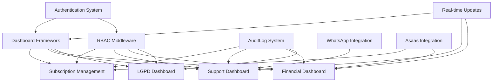

# Análise Técnica - Painel Administrativo SVLentes

**Data:** 2025-10-19
**Versão:** 1.0
**Base:** Especificação Técnica existente vs Estrutura do projeto atual
**Status:** Análise Completa

---

## 1. Requisitos Funcionais Detalhados

### RF-001: Dashboard Home (Visão Geral)

**User Stories Detalhadas:**

**US-001.1: Medical Administrator Dashboard**
- **Como** Administrador Médico (Dr. Philipe)
- **Eu quero** ver alertas de emergência e fila de validação de prescrições imediatamente ao fazer login
- **Para que** eu possa priorizar a segurança dos pacientes

**Critérios de Aceite:**
- [ ] Dashboard carrega em <2 segundos com widgets específicos para médico
- [ ] Alertas de emergência exibidos em vermelho pulsante no topo
- [ ] Fila de validação de prescrições com contagem real-time
- [ ] Métricas de conformidade LGPD para consentimentos médicos
- [ ] Acesso rápido a pacientes com dados expirados

**US-001.2: Support Manager Dashboard**
- **Como** Gerente de Suporte
- **Eu quero** ver contagem de tickets abertos e alertas de SLA
- **Para que** eu possa alocar recursos de suporte eficientemente

**Critérios de Aceite:**
- [ ] Indicadores visuais de SLA (verde >2hrs, amarelo <2hrs, vermelho <30min)
- [ ] Taxa de automação do chatbot (objetivo: 70%)
- [ ] Tempo médio de resposta em destaque
- [ ] Conversações WhatsApp ativas com flag de intervenção manual

**US-001.3: Operations Administrator Dashboard**
- **Como** Administrador de Operações
- **Eu quero** ver receita diária, assinaturas ativas e taxa de sucesso de pagamentos
- **Para que** eu possa monitorar a saúde financeira do negócio

**Critérios de Aceite:**
- [ ] MRR (Receita Mensal Recorrente) em destaque
- [ ] Gráfico de sucesso de pagamentos (últimos 7 dias)
- [ ] Contagem de assinaturas por status (ativas, atrasadas, pausadas)
- [ ] Pedidos pendentes de processamento

**US-001.4: System Administrator Dashboard**
- **Como** Administrador de Sistema
- **Eu quero** ver status de saúde do sistema e alertas de integração
- **Para que** eu possa resolver problemas técnicos proativamente

**Critérios de Aceite:**
- [ ] Status de infraestrutura (banco, APIs, serviços)
- [ ] Saúde de integrações (Asaas, SendPulse, Firebase)
- [ ] Taxa de erros da API em tempo real
- [ ] Uso de memória e CPU do servidor

**Dependências:**
- Sistema de autenticação NextAuth.js extendido com roles de admin
- Middleware de verificação de permissões
- Sistema de widgets configuráveis por role
- WebSocket ou polling para atualizações em tempo real

---

### RF-002: Gestão de Assinaturas

**User Stories Detalhadas:**

**US-002.1: Busca Avançada de Assinaturas**
- **Como** Administrador de Operações
- **Eu quero** buscar assinaturas por email, telefone ou ID da assinatura
- **Para que** eu possa localizar contas de clientes rapidamente

**Critérios de Aceite:**
- [ ] Busca retorna resultados em <500ms
- [ ] Filtros por status, plano, período de datas
- [ ] Paginação com 50 itens por página
- [ ] Seleção múltipla para operações em lote

**US-002.2: Visualização Detalhada da Assinatura**
- **Como** Gerente de Suporte
- **Eu quero** ver histórico completo de assinatura, pagamentos e pedidos
- **Para que** eu possa resolver disputas de cobrança

**Critérios de Aceite:**
- [ ] Informações completas do usuário com avatar
- [ ] Histórico de pagamentos com links para faturas
- [ ] Timeline de alterações da assinatura
- [ ] Status da entrega com código de rastreamento

**US-002.3: Modificação de Assinatura**
- **Como** Administrador de Operações
- **Eu quero** modificar plano, endereço ou método de pagamento
- **Para que** eu possa atender solicitações de clientes

**Critérios de Aceite:**
- [ ] Modal de alteração de plano com prós e contras
- [ ] Validação de endereço com API externa
- [ ] Confirmação por email após alteração
- [ ] Histórico auditado de todas as mudanças

**Dependências:**
- Modelos `Subscription`, `SubscriptionHistory`, `Payment`, `Order` existentes
- API de integração Asaas existente
- Sistema de auditoria `AuditLog` (necessário implementar)

---

### RF-003: Dashboard de Suporte ao Cliente

**User Stories Detalhadas:**

**US-003.1: Gestão de Fila de Tickets**
- **Como** Gerente de Suporte
- **Eu quero** ver tickets priorizados por urgência de SLA
- **Para que** eu possa prevenir violações de SLA

**Critérios de Aceite:**
- [ ] Lista de tickets com contadores de SLA regressivos
- [ ] Filtros rápidos: Meus Tickets, Não Atribuídos, Risco SLA
- [ ] Alocação automática baseada em carga de trabalho
- [ ] Escalonamento automático para tickets médicos

**US-003.2: Monitoramento WhatsApp**
- **Como** Agente de Suporte
- **Eu quero** ver conversas WhatsApp em tempo real
- **Para que** eu possa intervir quando o AI falhar

**Critérios de Aceite:**
- [ ] Lista de conversas ativas com status de IA
- [ ] Tomada de controle manual desabilitando IA em 5 segundos
- [ ] Interface de resposta com templates pré-definidos
- [ ] Análise de sentimento e intenção das mensagens

**US-003.3: Análise de Performance da IA**
- **Como** Gerente de Suporte
- **Eu quero** analisar métricas de performance do chatbot
- **Para que** eu possa melhorar respostas automatizadas

**Critérios de Aceite:**
- [ ] Taxa de automação vs intervenção humana
- [ ] Precisão de classificação de intenção
- [ ] Tempo médio de resposta IA vs humano
- [ ] Padrões de falha comuns

**Dependências:**
- Integração SendPulse existente
- Sistema LangChain + OpenAI existente
- Modelos `SupportTicket`, `WhatsAppConversation`, `WhatsAppInteraction` existentes
- Interface de gestão de FAQs (necessário implementar)

---

### RF-004: Gestão Financeira e Pagamentos

**User Stories Detalhadas:**

**US-004.1: Dashboard de Pagamentos**
- **Como** Administrador de Operações
- **Eu quero** ver taxa de sucesso de pagamentos diários
- **Para que** eu possa identificar problemas de processamento

**Critérios de Aceite:**
- [ ] Métricas em tempo real: receita do dia, taxa de sucesso
- [ ] Gráfico de distribuição de status de pagamentos
- [ ] Análise por método (PIX, Boleto, Cartão)
- [ ] Alertas para falhas de pagamento >10%

**US-004.2: Reembolso e Disputas**
- **Como** Gerente de Suporte
- **Eu quero** processar reembolsos e disputas
- **Para que** eu possa resolver problemas de cobrança

**Critérios de Aceite:**
- [ ] Interface de reembolso com seleção de motivo
- [ ] Confirmação secundária para reembolsos >R$100
- [ ] Integração com Asaas para processamento
- [ ] Notificação automática ao cliente

**US-004.3: Reconciliação Financeira**
- **Como** Administrador de Operações
- **Eu quero** gerar relatórios financeiros e reconciliar pagamentos
- **Para que** eu possa realizar análise financeira

**Critérios de Aceite:**
- [ ] Exportação em CSV/Excel para períodos personalizados
- [ ] Comparação entre dados Asaas e banco local
- [ ] Relatórios de MRR, churn, LTV
- [ ] Detecção automática de discrepâncias

**Dependências:**
- API Asaas existente com webhooks implementados
- Modelo `Payment` existente e completo
- Sistema de notificações existente
- Interface de relatórios (necessário implementar)

---

### RF-005: Gestão de LGPD e Conformidade

**User Stories Detalhadas:**

**US-005.1: Processamento de Solicitações de Dados**
- **Como** Oficial de LGPD
- **Eu quero** processar solicitações de acesso e exclusão de dados
- **Para que** eu possa cumprir requisitos legais

**Critérios de Aceite:**
- [ ] Fila de solicitações com contador de SLA de 15 dias
- [ ] Exportação completa de dados em JSON/CSV/PDF
- [ ] Verificação de identidade antes processar
- [ ] Exclusão física de registros (não apenas soft delete)

**US-005.2: Gestão de Consentimentos**
- **Como** Oficial de LGPD
- **Eu quero** auditar logs de consentimento
- **Para que** eu possa verificar legalidade do processamento

**Critérios de Aceite:**
- [ ] Visualização de todos os tipos de consentimento
- [ ] Alertas para consentimentos expirando (30 dias)
- [ ] Relatório de conformidade em tempo real
- [ ] Rastreamento de versões de termos

**US-005.3: Auditoria e Relatórios**
- **Como** Oficial de LGPD
- **Eu quero** gerar relatórios de conformidade para auditorias
- **Para que** eu possa demonstrar aderência à LGPD

**Critérios de Aceite:**
- [ ] Score de conformidade calculado automaticamente
- [ ] Exportação de logs de auditoria por período
- [ ] Relatórios pré-formatados para autoridades
- [ ] Rastreamento de acesso a dados sensíveis

**Dependências:**
- Modelos `ConsentLog`, `DataRequest` existentes
- Sistema de auditoria `AuditLog` (necessário implementar)
- Interface de exportação de dados (necessário implementar)
- Criptografia de dados sensíveis existente

---

## 2. Análise de Gap vs Sistema Atual

### 2.1 O que Já Existe ✅

**Infraestrutura de Autenticação:**
- NextAuth.js configurado com Firebase
- Modelo `User` com campo `role` (limitado a "subscriber")
- Sistema de sessões funcionando

**Modelos de Dados Principais:**
- `Subscription`: Completo com lifecycle tracking
- `Payment`: Completo com integração Asaas
- `Order`: Status e rastreamento implementados
- `SupportTicket`: Modelo básico existente
- `WhatsAppConversation`/`WhatsAppInteraction`: Chatbot implementado
- `ConsentLog`: Registro de consentimentos LGPD

**APIs e Integrações:**
- Asaas: Pagamentos e assinaturas funcionais
- SendPulse: WhatsApp e chatbot implementados
- Webhooks: Asaas e SendPulse recebendo eventos
- Sistema de notificações funcionando

**Sistema de Monitoramento Básico:**
- `/api/health-check`: Verificação de saúde básica
- `/api/monitoring/errors`: Logging de erros
- `/api/admin/feature-flags`: Gestão de features flags
- `/api/admin/sendpulse-health`: Saúde do WhatsApp

**Componentes UI:**
- Design system com shadcn/ui implementado
- Dashboard de assinante funcional
- Componentes de formulários e validação

### 2.2 O que Precisa ser Construído 🚧

**Sistema de Administração (Prioridade 1):**
- [ ] Extensão do modelo `User` com roles de admin
- [ ] Middleware de autenticação para rotas admin
- [ ] Layout admin com navegação lateral
- [ ] Sistema de permissões RBAC
- [ ] Página de login admin dedicada

**APIs Administrativas (Prioridade 1):**
- [ ] `/api/admin/subscriptions/*` - CRUD de assinaturas
- [ ] `/api/admin/support/tickets/*` - Gestão de suporte
- [ ] `/api/admin/payments/*` - Gestão financeira
- [ ] `/api/admin/orders/*` - Gestão de pedidos
- [ ] `/api/admin/users/*` - Gestão de usuários admin

**Componentes de Dashboard (Prioridade 2):**
- [ ] Widget system configurável por role
- [ ] Data tables com sorting, filtering, pagination
- [ ] Modals para confirmações e formulários
- [ ] Sistema de notificações em tempo real
- [ ] Interface de busca global

**Funcionalidades Específicas (Prioridade 3):**
- [ ] Sistema de auditoria `AuditLog`
- [ ] Interface de gestão de LGPD
- [ ] Sistema de relatórios e exportações
- [ ] Monitoramento avançado de integrações
- [ ] Sistema de alertas e notificações

### 2.3 Riscos e Bloqueios Identificados

**Riscos Técnicos:**
- 🔴 **Performance**: Grandes volumes de dados podem impactar performance
- 🟡 **Integrações**: Dependência de APIs terceiras (Asaas, SendPulse)
- 🟡 **Complexidade**: Sistema de permissões precisa ser robusto

**Riscos de Negócio:**
- 🔴 **LGPD**: Conformidade legal crítica, sem margem para erros
- 🔴 **Dados Médicos**: Requisitos de segurança e audit trail rigorosos
- 🟡 **Adoção**: Usuários admin precisam de treinamento

**Bloqueios:**
- 🚫 **Modelo de Admin**: Sistema atual não suporta múltiplos roles admin
- 🚫 **Auditoria**: Sistema completo de audit trail não implementado
- 🚫 **Interface Admin**: Nenhuma interface administrativa existente

---

## 3. Especificação de APIs RESTful

### 3.1 Arquitetura e Padrões

**Base URL:** `/api/admin/`
**Autenticação:** NextAuth.js session + role validation
**Formato Resposta:** JSON
**Status Codes:** HTTP standards (200, 201, 400, 401, 403, 404, 500)

**Middleware Necessário:**
```typescript
// Verificação de autenticação admin
export async function requireAdmin(request: NextRequest) {
  const session = await getServerSession(authOptions)

  if (!session || !session.user) {
    throw new Error('Unauthenticated')
  }

  const adminRoles = ['medical_admin', 'operations_admin',
                      'support_manager', 'system_admin', 'lgpd_officer']

  if (!adminRoles.includes(session.user.role)) {
    throw new Error('Unauthorized: Admin access required')
  }

  return session.user
}
```

### 3.2 APIs de Gestão de Assinaturas

**GET /api/admin/subscriptions**
```typescript
// Query params
interface SubscriptionListQuery {
  page?: number
  limit?: number
  status?: SubscriptionStatus[]
  planType?: string[]
  dateRange?: { start: string, end: string }
  search?: string
  sortBy?: 'createdAt' | 'renewalDate' | 'monthlyValue'
  sortOrder?: 'asc' | 'desc'
}

// Response
interface SubscriptionListResponse {
  success: boolean
  data: Subscription[]
  metadata: {
    pagination: {
      page: number
      total: number
      hasMore: boolean
    }
    filters: {
      activeFilters: string[]
      totalCount: number
    }
  }
}
```

**GET /api/admin/subscriptions/[id]**
```typescript
// Response
interface SubscriptionDetailResponse {
  success: boolean
  data: {
    subscription: Subscription
    user: User
    payments: Payment[]
    orders: Order[]
    history: SubscriptionHistory[]
    metrics: {
      lifetimeValue: number
      totalPayments: number
      daysActive: number
      averagePaymentValue: number
    }
  }
}
```

**PATCH /api/admin/subscriptions/[id]**
```typescript
// Request body
interface UpdateSubscriptionRequest {
  planType?: string
  shippingAddress?: object
  paymentMethod?: PaymentMethod
  metadata?: object
  changeReason?: string
}

// Response
interface UpdateSubscriptionResponse {
  success: boolean
  data: Subscription
  message: string
}
```

**POST /api/admin/subscriptions/[id]/pause**
```typescript
// Request body
interface PauseSubscriptionRequest {
  reason: string
  resumeDate?: string // Optional: YYYY-MM-DD
  notifyCustomer?: boolean
}

// Response
interface PauseSubscriptionResponse {
  success: boolean
  data: Subscription
  message: string
}
```

### 3.3 APIs de Suporte ao Cliente

**GET /api/admin/support/tickets**
```typescript
// Query params
interface TicketListQuery {
  page?: number
  limit?: number
  status?: SupportStatus[]
  priority?: SupportPriority[]
  category?: SupportCategory[]
  assignedAgent?: string
  dateRange?: { start: string, end: string }
  slaRisk?: boolean // Show tickets at risk of SLA breach
}

// Response
interface TicketListResponse {
  success: boolean
  data: {
    tickets: SupportTicket[]
    slaMetrics: {
      breachRisk: number
      averageResponseTime: number
      resolutionRate: number
    }
  }
}
```

**PATCH /api/admin/support/tickets/[id]**
```typescript
// Request body
interface UpdateTicketRequest {
  status?: SupportStatus
  assignedAgentId?: string
  priority?: SupportPriority
  internalNotes?: string
  resolution?: string
}

// Response
interface UpdateTicketResponse {
  success: boolean
  data: SupportTicket
  message: string
}
```

**GET /api/admin/support/whatsapp/conversations**
```typescript
// Query params
interface ConversationListQuery {
  page?: number
  limit?: number
  status?: 'active' | 'inactive'
  humanIntervention?: boolean
  dateRange?: { start: string, end: string }
  search?: string // phone or customer name
}

// Response
interface ConversationListResponse {
  success: boolean
  data: {
    conversations: WhatsAppConversation[]
    metrics: {
      activeConversations: number
      humanInterventionRate: number
      automationRate: number
      averageResponseTime: number
    }
  }
}
```

**POST /api/admin/support/whatsapp/takeover**
```typescript
// Request body
interface TakeoverRequest {
  conversationId: string
  agentId: string
  reason: string
}

// Response
interface TakeoverResponse {
  success: boolean
  data: {
    conversationId: string
    status: 'human_control'
    timestamp: string
  }
}
```

### 3.4 APIs Financeiras

**GET /api/admin/payments**
```typescript
// Query params
interface PaymentListQuery {
  page?: number
  limit?: number
  status?: PaymentStatus[]
  billingType?: PaymentMethod[]
  dateRange?: { start: string, end: string }
  amountRange?: { min: number, max: number }
  subscriptionId?: string
}

// Response
interface PaymentListResponse {
  success: boolean
  data: {
    payments: Payment[]
    summary: {
      totalAmount: number
      successRate: number
      pendingCount: number
      failedCount: number
    }
  }
}
```

**POST /api/admin/payments/[id]/refund**
```typescript
// Request body
interface RefundRequest {
  amount?: number // Optional: full refund if not specified
  reason: string
  notifyCustomer?: boolean
  requiresApproval?: boolean // For amounts > threshold
}

// Response
interface RefundResponse {
  success: boolean
  data: Payment
  message: string
  approvalRequired?: boolean
}
```

**GET /api/admin/payments/analytics**
```typescript
// Query params
interface AnalyticsQuery {
  period: '7d' | '30d' | '90d' | '1y'
  groupBy?: 'day' | 'week' | 'month'
  metrics?: string[] // ['revenue', 'success_rate', 'churn', 'ltv']
}

// Response
interface AnalyticsResponse {
  success: boolean
  data: {
    mrr: number
    arr: number
    churnRate: number
    ltv: number
    revenueByPeriod: {
      date: string
      revenue: number
      successful: number
      failed: number
    }[]
    paymentMethodBreakdown: {
      method: string
      count: number
      percentage: number
    }[]
  }
}
```

### 3.5 APIs de LGPD

**GET /api/admin/lgpd/requests**
```typescript
// Query params
interface DataRequestListQuery {
  page?: number
  limit?: number
  status?: DataRequestStatus[]
  type?: DataRequestType[]
  dateRange?: { start: string, end: string }
  slaRisk?: boolean // Show requests approaching 15-day deadline
}

// Response
interface DataRequestListResponse {
  success: boolean
  data: {
    requests: DataRequest[]
    slaMetrics: {
      pendingCount: number
      approachingDeadline: number
      overdueCount: number
      averageProcessingTime: number
    }
  }
}
```

**GET /api/admin/lgpd/requests/[id]/export**
```typescript
// Query params
interface ExportQuery {
  format: 'json' | 'csv' | 'pdf'
  includeSensitive?: boolean
  redactPII?: boolean
}

// Response
interface ExportResponse {
  success: boolean
  data: {
    downloadUrl: string
    expiresAt: string
    format: string
    size: number
  }
}
```

**GET /api/admin/lgpd/compliance**
```typescript
// Response
interface ComplianceResponse {
  success: boolean
  data: {
    overallScore: number // 0-100
    categories: {
      consentManagement: {
        score: number
        issues: string[]
        totalUsers: number
        validConsents: number
      }
      dataRequests: {
        score: number
        pendingRequests: number
        overdueRequests: number
        averageProcessingTime: number
      }
      auditTrail: {
        score: number
        totalActions: number
        loggedActions: number
        gaps: string[]
      }
      dataRetention: {
        score: number
        expiredData: number
        scheduledDeletion: number
        complianceIssues: string[]
      }
    }
    lastUpdated: string
  }
}
```

---

## 4. Matriz de Rastreabilidade

### 4.1 Mapeamento Requisitos → Componentes Técnicos

| ID Requisito | User Story | Componente Frontend | API Backend | Modelo de Dados | Prioridade | Complexidade |
|--------------|------------|---------------------|-------------|-----------------|------------|--------------|
| RF-001 | US-001.1 | Dashboard Medical | GET /api/admin/dashboard | User, Subscription, ConsentLog | **Alta** | Média |
| RF-001 | US-001.2 | Dashboard Support | GET /api/admin/dashboard | SupportTicket, WhatsAppConversation | **Alta** | Média |
| RF-001 | US-001.3 | Dashboard Operations | GET /api/admin/dashboard | Subscription, Payment, Order | **Alta** | Média |
| RF-001 | US-001.4 | Dashboard System | GET /api/admin/dashboard | SystemHealth, ErrorLog | Alta | Baixa |
| RF-002 | US-002.1 | SubscriptionList | GET /api/admin/subscriptions | Subscription, User | **Alta** | Média |
| RF-002 | US-002.2 | SubscriptionDetail | GET /api/admin/subscriptions/[id] | Subscription, Payment, Order, SubscriptionHistory | **Alta** | Alta |
| RF-002 | US-002.3 | SubscriptionEdit | PATCH /api/admin/subscriptions/[id] | Subscription, SubscriptionHistory | **Alta** | Alta |
| RF-003 | US-003.1 | TicketQueue | GET /api/admin/support/tickets | SupportTicket, User | **Alta** | Média |
| RF-003 | US-003.2 | WhatsAppMonitor | GET /api/admin/support/whatsapp | WhatsAppConversation, WhatsAppInteraction | **Alta** | Alta |
| RF-003 | US-003.3 | AIAnalytics | GET /api/admin/support/analytics | WhatsAppInteraction, SupportTicket | Média | Alta |
| RF-004 | US-004.1 | PaymentDashboard | GET /api/admin/payments | Payment, Subscription | **Alta** | Média |
| RF-004 | US-004.2 | RefundInterface | POST /api/admin/payments/[id]/refund | Payment | **Alta** | Média |
| RF-004 | US-004.3 | FinancialReports | GET /api/admin/payments/analytics | Payment, Subscription | Média | Alta |
| RF-005 | US-005.1 | DataRequestQueue | GET /api/admin/lgpd/requests | DataRequest | **Alta** | Alta |
| RF-005 | US-005.2 | ConsentManager | GET /api/admin/lgpd/consents | ConsentLog | Alta | Média |
| RF-005 | US-005.3 | AuditTrail | GET /api/admin/lgpd/audit | AuditLog | **Alta** | Alta |

### 4.2 Matriz de Dependências



### 4.3 Análise de Esforço por Fase

**Phase 1: Foundation (Semanas 1-4)**
- Authentication & RBAC: 40h
- Dashboard Framework: 60h
- Subscription Management: 80h
- **Total Phase 1: 180h**

**Phase 2: Support & Finance (Semanas 5-8)**
- Support Dashboard: 60h
- WhatsApp Integration: 40h
- Financial Dashboard: 50h
- Payment Management: 50h
- **Total Phase 2: 200h**

**Phase 3: Orders & LGPD (Semanas 9-12)**
- Order Management: 40h
- LGPD Dashboard: 80h
- Audit System: 40h
- Data Export Tools: 40h
- **Total Phase 3: 200h**

**Phase 4: System & Polish (Semanas 13-16)**
- System Monitoring: 40h
- User Management: 30h
- Error Tracking: 30h
- Performance Optimization: 60h
- **Total Phase 4: 160h**

**Total Estimado: 740h (≈18 semanas)**

### 4.4 Riscos Técnicos por Componente

| Componente | Risco | Impacto | Mitigação |
|------------|-------|---------|------------|
| RBAC System | Alto | Crítico | Implementar testes unitários completos |
| Real-time Updates | Médio | Alto | Usar WebSocket fallback para polling |
| AuditLog Performance | Médio | Médio | Implementar batch inserts |
| Data Export LGPD | Alto | Crítico | Testar com grandes volumes de dados |
| WhatsApp Takeover | Baixo | Médio | Implementar retry mechanism |
| Payment Refunds | Médio | Alto | Double verification com Asaas |

### 4.5 Requisitos de Qualidade

**Performance:**
- Dashboard load: <2s (p95)
- API response: <300ms (média)
- Search results: <500ms
- Data export: <10s (1 ano de dados)

**Segurança:**
- 100% das rotas admin protegidas
- Auditoria completa de todas as ações
- Criptografia de dados sensíveis
- Rate limiting por usuário

**Disponibilidade:**
- Uptime target: 99.5%
- Error rate: <1%
- Database uptime: 99.9%

**Escalabilidade:**
- Suportar 10+ usuários admin simultâneos
- Processar 100K+ registros em relatórios
- Cache para consultas frequentes

---

## 5. Recomendações de Implementação

### 5.1 Priorização Sugerida

**MVP (Mínimo Viável):**
1. Authentication + RBAC
2. Dashboard básico por role
3. Gestão de assinaturas (CRUD)
4. Lista de tickets de suporte
5. Monitoramento básico de pagamentos

**Fase 2:**
1. Gestão completa de suporte
2. Dashboard financeiro
3. Sistema de auditoria
4. Interface LGPD básica

**Fase 3:**
1. Monitoramento avançado
2. Relatórios e analytics
3. Gestão de usuários admin
4. Otimização de performance

### 5.2 Considerações Técnicas

**Database:**
- Adicionar índices para performance
- Implementar soft delete para auditoria
- Considerar Redis para cache

**Frontend:**
- React Query para cache e sincronização
- Component library consistente
- Responsive design (desktop-first)

**Backend:**
- Middleware centralizado de autenticação
- Error handling padronizado
- Logging estruturado

**Integrações:**
- Retry logic para APIs externas
- Queue system para webhooks
- Health checks automatizados

### 5.3 Próximos Passos

1. **Validação de Requisitos:** Revisar com stakeholders cada user story
2. **Design System:** Criar componentes admin específicos
3. **Architecture Review:** Validar estrutura técnica com time de desenvolvimento
4. **Security Review:** Análise de segurança e conformidade LGPD
5. **Planning Detalhado:** Breakdown por sprints com entregas semanais

---

**Conclusão:**

O painel administrativo SVLentes é um projeto complexo mas bem definido. A infraestrutura atual (Next.js, Prisma, Asaas, SendPulse) proporciona uma base sólida. Os principais desafios são:

1. **Sistema de RBAC robusto** para múltiplos níveis de acesso
2. **Conformidade LGPD completa** com audit trail detalhado
3. **Performance em grande escala** para volumes crescentes de dados
4. **Integrações em tempo real** com WhatsApp e sistema de pagamentos

Com a arquitetura proposta e implementação faseada, o projeto pode ser entregue em ~18 semanas com baixo risco técnico e alto valor de negócio.

---

**Documentos Relacionados:**
- Especificação Técnica Completa (admin-dashboard-specs.md)
- API Documentation (será gerada durante implementação)
- Security & Compliance Matrix (anexo)
- Performance Benchmarks (anexo)