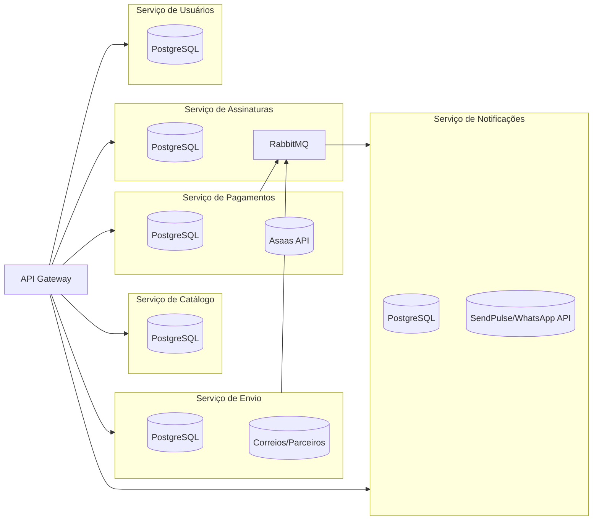
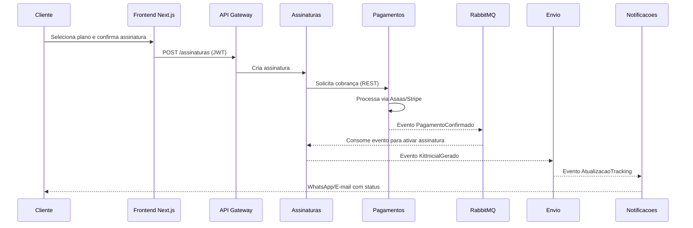

# Arquitetura de Microserviços para svlentes.com.br

## Visão Geral
- Evoluir do monólito atual para uma malha de microserviços independentes alinhados aos domínios de negócio (Assinaturas, Catálogo de Lentes, Usuários, Pagamentos, Logística/Envio e Comunicação/Notificações).
- Cada serviço expõe APIs REST e, quando necessário, GraphQL federado para agregações de dados em tempo real.
- Padronizar contratos com OpenAPI 3.1, versionados em repositórios individuais e publicados automaticamente no portal de desenvolvedores.

## Componentes de Negócio
### Serviço de Gestão de Assinaturas
- Orquestra ciclo de vida de planos (criação, alteração, pausa, cancelamento) e renovações automáticas.
- Processa regras de elegibilidade clínica e políticas de lentes personalizadas.
- Consome eventos de Pagamentos para confirmar ativações e gerar faturas recorrentes.

### Serviço de Catálogo de Lentes
- Mantém inventário de lentes, parâmetros médicos e recomendações.
- Disponibiliza GraphQL para consultas avançadas pelo time de vendas e parceiros ópticos.
- Integra com fornecedores para sincronização diária via webhooks/ETL.

### Serviço de Usuários & Identidade
- Cadastro, autenticação, recuperação de senha e gestão de consentimentos (LGPD).
- Emite tokens JWT com scopes específicos por serviço e suporta OAuth 2.1 / OpenID Connect para parceiros.
- Armazena preferências de comunicação e histórico de prescrições (com criptografia em repouso).

### Serviço de Pagamentos
- Integra Asaas como gateway primário e Stripe como fallback.
- Garante idempotência nas cobranças, reconciliação com contabilidade e webhooks assinados.
- Expõe endpoints seguros para renegociação, mudança de método de pagamento e split entre fornecedores.

### Serviço de Envio & Logística
- Calcula SLA por região, gera etiquetas e acompanha tracking em parceiros de entrega.
- Usa filas de mensagens para atualizar status e notificar clientes sobre atrasos.
- Oferece API para SAC consultar entregas e acionar reenvios.

### Serviço de Comunicação & Notificações
- Centraliza disparos (e-mail, SMS, WhatsApp) e orquestra fluxos multicanal.
- Possui templates versionados e rastreamento de métricas de engajamento.
- Integra com SendPulse/WhatsApp Business API via webhooks resilientes.

## Comunicação entre Serviços
- Async-first usando RabbitMQ (fila) para eventos críticos ("PagamentoConfirmado", "EnvioDespachado", "AssinaturaAtualizada").
- Redis Streams para mensagens de baixa latência e cache compartilhado de leitura.
- API Gateway (Kong ou Istio Ingress Gateway) para roteamento, rate limiting e autenticação centralizada.

## Dados & Persistência
- Cada microserviço possui banco PostgreSQL dedicado (schema isolado) para consistência e autonomia.
- Migrações gerenciadas via Flyway ou Liquibase, com versionamento semântico.
- Data Lake em armazenamento de objetos (S3/Azure Blob) para relatórios e IA, com ingestão por jobs de ETL agendados no serviço de Assinaturas.

## Infraestrutura & Deployment
- Contêineres Docker padronizados com imagens base minimalistas (Distroless ou Alpine).
- Orquestração com Kubernetes (AKS/EKS/GKE) utilizando Helm Charts por serviço e Kustomize para overlays de ambiente (dev/stage/prod).
- Service Mesh (Istio ou Linkerd) para observabilidade, mTLS entre pods e políticas de tráfego (circuit breaking, retries).
- Uso de Horizontal Pod Autoscaler (HPA) com métricas de CPU, memória e filas para escalabilidade automática.

## Frontend
- Next.js 15 com App Router, SSR para páginas dinâmicas (planos, dashboard do assinante) e SSG para conteúdo institucional.
- Comunicação com backend via GraphQL Gateway (Apollo Federation) e REST para operações críticas (checkout) com SWR/React Query.
- Design system baseado em shadcn/ui e Tailwind, com internacionalização (i18next) e acessibilidade WCAG 2.1 AA.

## Segurança
- Autenticação com JWT de curta duração e refresh tokens assinados por chave rotativa (JWKS publicado pelo serviço de Usuários).
- Autorização baseada em atributos (ABAC) utilizando scopes e roles aplicadas no API Gateway.
- mTLS entre serviços no cluster, Secrets gerenciados pelo Vault ou Secret Manager da nuvem.
- Compliance LGPD: consentimento granular, direito ao esquecimento e auditoria de acesso via trilhas imutáveis (PostgreSQL + Hashicorp Vault audit devices).
- Security scans automáticos (Snyk/Trivy) e política de dependências assinadas (Sigstore Cosign).

## Qualidade, Testes e Observabilidade
- Testes unitários e de contrato por serviço (JUnit/Nest Testing), testes de integração com TestContainers e suites end-to-end com Playwright + environments dedicados.
- Pipelines CI/CD (GitHub Actions) com stages: lint → testes → build imagem → scan → deploy em ambiente de staging → testes automatizados → aprovação manual → produção.
- Observabilidade full-stack: logs estruturados para ELK/EFK, métricas Prometheus + Grafana, tracing distribuído com OpenTelemetry + Jaeger.
- Feature flags centralizadas (ConfigCat ou LaunchDarkly) e Chaos Engineering (Litmus) para validar resiliência.

## Ambiente de Desenvolvimento
- Repositório "dev-env" com Docker Compose orquestrando microserviços, PostgreSQL, Redis, RabbitMQ, MinIO (S3 compatível), Mailhog, e serviços simulados (Azurite ou LocalStack).
- Scripts `make up` / `make down` para subir/derrubar stack local e seeds automatizadas via Prisma/Flyway.
- Perfis de configuração "dev", "staging" e "prod" com variáveis versionadas em `.env.example` e segredos via Vault CLI.

## Dados Compartilhados & Governança
- Catálogo de eventos (AsyncAPI) e dicionário de dados mantidos pelo time de plataforma.
- Contratos de SLA entre times (SLO/SLA/SLI) com objetivos definidos no Prometheus (Service Level Objectives).
- Documentação contínua no portal interno (Backstage) e playbooks de operação para incidentes.

## Diagramas

## Próximos Passos
1. Criar repositórios por domínio seguindo padrões de pipeline compartilhados.
2. Configurar infraestrutura básica em Kubernetes (cluster, ingress, pipelines Helm).
3. Priorizar migração de funcionalidades críticas (assinaturas e pagamentos) garantindo paridade funcional.
4. Implementar monitoramento e alertas antes do corte para produção.
