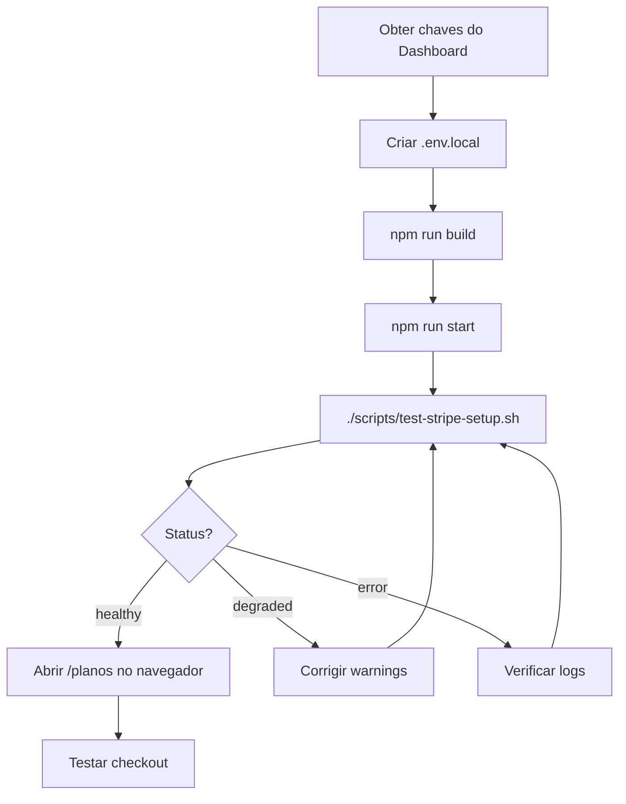
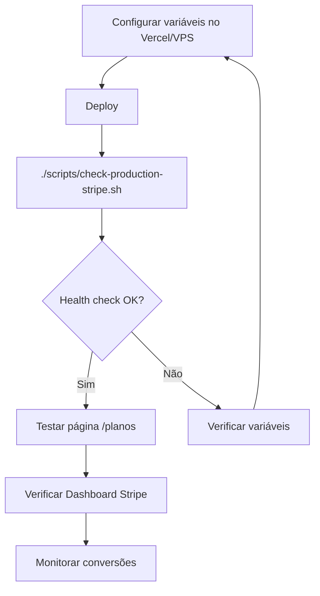

# 📚 Índice de Recursos - Verificação Stripe

**Criado em:** 10 de novembro de 2025  
**Projeto:** SV Lentes Hero Shop  
**Objetivo:** Verificação completa da integração Stripe em produção

---

## 📄 Documentação

### 1. Sumário Executivo
**Arquivo:** `docs/STRIPE_EXECUTIVE_SUMMARY.md`  
**Conteúdo:**
- Status atual da integração
- Checklist de validação
- Próximos passos
- Métricas de sucesso

**Para quem:** Gerentes, Product Owners, Líderes Técnicos

---

### 2. Relatório Completo de Verificação
**Arquivo:** `docs/STRIPE_INTEGRATION_VERIFICATION_REPORT.md`  
**Conteúdo:** (13 seções)
1. Verificação dos Prefixos das Chaves
2. Verificação do Servidor (VPS/Docker)
3. Verificação do Build Next.js
4. Health Check Endpoint
5. Verificação de Headers e CSP
6. Verificação de Conectividade
7. Inspeção de Rede (DevTools)
8. Logs do Dashboard Stripe
9. Stripe CLI - Validação Local
10. Checklist Final de Integração
11. Próximos Passos Recomendados
12. Suporte e Recursos
13. Conclusão

**Para quem:** Desenvolvedores, DevOps, Arquitetos

---

### 3. Guia Rápido de Setup
**Arquivo:** `docs/STRIPE_QUICK_SETUP.md`  
**Conteúdo:**
- Setup em 5 minutos
- Comandos copy-paste
- Troubleshooting rápido
- Deploy para produção

**Para quem:** Desenvolvedores que precisam configurar rapidamente

---

## 🛠️ Scripts de Automação

### 1. Verificação Completa Local
**Arquivo:** `scripts/check-stripe-integration.sh`  
**Uso:**
```bash
./scripts/check-stripe-integration.sh
```

**O que faz:**
- ✅ Verifica prefixos das chaves (pk_/sk_)
- ✅ Valida build do Next.js
- ✅ Testa conectividade com domínios Stripe
- ✅ Analisa headers (CSP, Permissions-Policy)
- ✅ Fornece checklist e próximos passos

**Quando usar:** Antes e depois de configurar variáveis localmente

---

### 2. Teste Rápido Pós-Configuração
**Arquivo:** `scripts/test-stripe-setup.sh`  
**Uso:**
```bash
./scripts/test-stripe-setup.sh
```

**O que faz:**
- ✅ Verifica existência de `.env.local`
- ✅ Valida prefixos das chaves
- ✅ Confirma que chaves são do mesmo ambiente
- ✅ Testa endpoint `/api/health/stripe`
- ✅ Fornece resultado OK ou ERRO com detalhes

**Quando usar:** Após configurar `.env.local` e fazer build

---

### 3. Verificação em Produção (Servidor)
**Arquivo:** `scripts/check-production-stripe.sh`  
**Uso:**
```bash
# Via SSH no servidor
ssh user@svlentes.com.br
./check-production-stripe.sh

# Ou remotamente
bash <(curl -s https://raw.githubusercontent.com/.../check-production-stripe.sh)
```

**O que faz:**
- ✅ Detecta tipo de deploy (Docker/Systemd/Traditional)
- ✅ Lista variáveis de ambiente (com prefixos apenas)
- ✅ Testa health check em produção
- ✅ Exibe logs recentes com menções ao Stripe
- ✅ Fornece comandos úteis para debug

**Quando usar:** Para diagnosticar problemas em produção

---

### 4. Validação Pós-Deploy (Existente)
**Arquivo:** `scripts/validate-stripe-pricing-table.sh`  
**Uso:**
```bash
./scripts/validate-stripe-pricing-table.sh
```

**O que faz:**
- Valida headers HTTP em produção
- Testa carregamento do pricing-table.js
- Fornece comandos para DevTools

**Quando usar:** Após fazer deploy para produção

---

## 🔌 API Endpoints

### 1. Health Check Stripe (NOVO)
**Endpoint:** `/api/health/stripe`  
**Método:** `GET`  
**Arquivo:** `src/app/api/health/stripe/route.ts`

**Resposta:**
```json
{
  "status": "healthy" | "degraded" | "error",
  "timestamp": "2025-11-10T12:00:00.000Z",
  "environment": "PRODUCTION" | "TEST" | "INVALID",
  "configuration": {
    "publishableKey": {
      "exists": true,
      "prefix": "pk_live_",
      "length": 107,
      "environment": "PRODUCTION",
      "isValid": true
    },
    "secretKey": { ... },
    "webhookSecret": { ... },
    "pricingTable": { ... }
  },
  "validation": {
    "environmentMatch": true,
    "allKeysConfigured": true,
    "allKeysValid": true,
    "pricingTableConfigured": true
  },
  "warnings": []
}
```

**Segurança:** ✅ NUNCA expõe chaves completas, apenas prefixos (8 primeiros caracteres)

**Uso:**
```bash
# Local
curl http://localhost:3000/api/health/stripe | jq

# Produção
curl https://svlentes.com.br/api/health/stripe | jq
```

---

### 2. Lista de Produtos Stripe (Existente)
**Endpoint:** `/api/stripe/products`  
**Método:** `GET`  
**Arquivo:** `src/app/api/stripe/products/route.ts`

**Resposta:**
```json
{
  "products": [
    {
      "id": "prod_...",
      "name": "Plano Básico",
      "description": "...",
      "prices": [...],
      "defaultPrice": { ... }
    }
  ],
  "count": 6
}
```

**Uso:** Fallback quando Pricing Table não carrega

---

## 📦 Componentes

### 1. StripePricingTable
**Arquivo:** `src/components/payment/StripePricingTable.tsx`  
**Props:**
```typescript
interface StripePricingTableProps {
  pricingTableId?: string
  publishableKey?: string
  clientReferenceId?: string
  customerEmail?: string
  customerSessionClientSecret?: string
  className?: string
  onFallbackActivate?: () => void
}
```

**Features:**
- ✅ Carrega script Stripe com retry
- ✅ Valida prefixos de chaves
- ✅ Fallback automático para API interna
- ✅ Estados de loading/error bem definidos
- ✅ Mobile optimized

---

### 2. StripeFallback
**Arquivo:** `src/components/payment/StripeFallback.tsx`  
**Uso:** Exibido quando Stripe não carrega

**Features:**
- Cartões estáticos de preços
- Redirecionamento para WhatsApp
- UI responsiva

---

## 🎯 Fluxo de Uso

### Para Desenvolvimento Local



### Para Produção



---

## 📋 Checklist de Verificação

### Antes de Configurar
- [ ] Ler `STRIPE_EXECUTIVE_SUMMARY.md`
- [ ] Ter acesso ao Dashboard Stripe
- [ ] Decidir: test mode ou live mode?

### Durante Configuração Local
- [ ] Copiar chaves do Dashboard
- [ ] Criar `.env.local` (usar template)
- [ ] Executar `npm run build`
- [ ] Executar `npm run start`
- [ ] Rodar `./scripts/test-stripe-setup.sh`
- [ ] Verificar health check retorna "healthy"

### Validação Local
- [ ] Abrir http://localhost:3000/planos
- [ ] DevTools → Network → Sem bloqueios
- [ ] DevTools → Console → Sem erros
- [ ] Pricing table visível e funcional
- [ ] Botões de assinatura funcionam

### Deploy Produção
- [ ] Configurar variáveis no Vercel/Docker/VPS
- [ ] Fazer deploy
- [ ] SSH no servidor → `./scripts/check-production-stripe.sh`
- [ ] Testar https://svlentes.com.br/api/health/stripe
- [ ] Testar https://svlentes.com.br/planos

### Pós-Deploy
- [ ] Verificar logs no Dashboard Stripe
- [ ] Testar fluxo completo de checkout
- [ ] Configurar webhooks
- [ ] Monitorar conversões

---

## 🆘 Troubleshooting Rápido

### Problema: "Stripe não está configurado"
**Solução:** Variáveis não definidas ou build não executado
```bash
# Verificar
cat .env.local | grep STRIPE

# Rebuildar
npm run build
```

---

### Problema: Health check retorna "degraded"
**Solução:** Ver warnings específicos
```bash
curl http://localhost:3000/api/health/stripe | jq '.warnings'
```

---

### Problema: Pricing table não aparece
**Solução 1:** Verificar console do navegador
```javascript
// No DevTools
console.log(typeof window.Stripe)
console.log(document.querySelector('stripe-pricing-table'))
```

**Solução 2:** Verificar CSP/Permissions-Policy
```bash
curl -I https://svlentes.com.br/planos | grep -i "content-security-policy\|permissions-policy"
```

---

### Problema: Chaves de ambientes diferentes
**Solução:** Usar chaves do mesmo ambiente
```bash
# Ambas devem ser test OU live
NEXT_PUBLIC_STRIPE_PUBLISHABLE_KEY=pk_test_...
STRIPE_SECRET_KEY=sk_test_...

# OU

NEXT_PUBLIC_STRIPE_PUBLISHABLE_KEY=pk_live_...
STRIPE_SECRET_KEY=sk_live_...
```

---

## 📞 Suporte

### Documentação Oficial
- **Stripe Docs:** https://stripe.com/docs
- **Pricing Table:** https://stripe.com/docs/payments/pricing-table
- **CSP Guide:** https://stripe.com/docs/security/guide#content-security-policy

### Scripts Criados
- Verificação completa: `./scripts/check-stripe-integration.sh`
- Teste rápido: `./scripts/test-stripe-setup.sh`
- Produção: `./scripts/check-production-stripe.sh`

### Endpoints
- Health check: `/api/health/stripe`
- Produtos: `/api/stripe/products`

### Contato Stripe
- Dashboard Support: https://dashboard.stripe.com/support
- Email: support@stripe.com

---

## 🎓 Conceitos Importantes

### 1. Prefixos de Chaves Stripe

| Prefixo | Tipo | Ambiente | Exposição |
|---------|------|----------|-----------|
| `pk_test_` | Publishable | Test | ✅ Cliente |
| `pk_live_` | Publishable | Live | ✅ Cliente |
| `sk_test_` | Secret | Test | ❌ Servidor |
| `sk_live_` | Secret | Live | ❌ Servidor |
| `whsec_` | Webhook Secret | Ambos | ❌ Servidor |
| `prctbl_` | Pricing Table ID | Ambos | ✅ Cliente |

### 2. Build Time vs Runtime (Next.js)

**Build Time (Variáveis `NEXT_PUBLIC_*`):**
- Injetadas no bundle JavaScript durante `npm run build`
- Acessíveis no cliente
- **IMPORTANTE:** Mudar valor → rebuild necessário

**Runtime (Variáveis sem `NEXT_PUBLIC_`):**
- Lidas em tempo de execução (API Routes, Server Components)
- Nunca expostas ao cliente
- Mudar valor → apenas restart necessário

### 3. CSP (Content Security Policy)

**Domínios Stripe a permitir:**
```
script-src: https://js.stripe.com https://*.stripecdn.com
frame-src: https://checkout.stripe.com https://js.stripe.com
connect-src: https://api.stripe.com https://m.stripe.com
img-src: https://*.stripe.com https://*.stripecdn.com
style-src: https://*.stripecdn.com
```

---

## 📈 Histórico de Mudanças

### 2025-11-10 (Criação Inicial)

**Criado:**
- ✅ Endpoint `/api/health/stripe`
- ✅ Script `check-stripe-integration.sh`
- ✅ Script `test-stripe-setup.sh`
- ✅ Script `check-production-stripe.sh`
- ✅ Documentação completa (3 arquivos)
- ✅ Este índice

**Modificado:**
- (Nenhuma modificação em código existente)

**Próximas Tarefas:**
- [ ] Configurar variáveis de ambiente
- [ ] Testar integração localmente
- [ ] Deploy em produção

---

**FIM DO ÍNDICE**

*Para começar, leia: `docs/STRIPE_EXECUTIVE_SUMMARY.md`*  
*Para configurar: `docs/STRIPE_QUICK_SETUP.md`*  
*Para detalhes: `docs/STRIPE_INTEGRATION_VERIFICATION_REPORT.md`*
